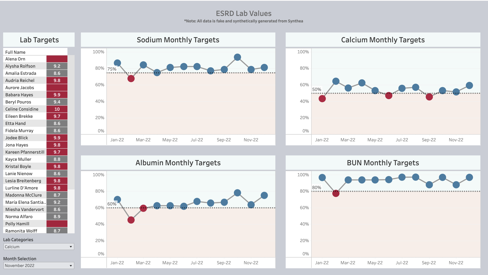

# Análisis y Visualización de Valores de Laboratorio ESRD - https://goo.su/5pJolnp

## Descripción del Proyecto
Este proyecto desarrolla un dashboard interactivo que visualiza indicadores clave de laboratorio para pacientes con Enfermedad Renal en Etapa Terminal (ESRD) utilizando datos sintéticos generados por Synthea. El análisis se realiza con SQL y PostgreSQL, y los resultados se presentan en gráficos interactivos para facilitar la interpretación de los datos.

---

## Contenido del Repositorio

- **`/sql_scripts/`**: Scripts SQL utilizados para la creación y análisis de la base de datos.
- **`/data/`**: Subconjunto de datos sintéticos (en formato CSV o SQL Dump) utilizados en el proyecto.
- **`/dashboard_images/`**: Capturas de pantalla del dashboard.
- **`README.md`**: Documentación principal del proyecto (este archivo).

---

## Objetivos del Proyecto

1. Visualizar el cumplimiento de valores objetivo para cuatro indicadores de laboratorio:
   - Sodio
   - Calcio
   - Albúmina
   - Nitrógeno ureico en sangre (BUN)
2. Identificar tendencias y desviaciones a lo largo del tiempo para apoyar decisiones clínicas.

---

## Requerimientos del Proyecto

### Software Necesario
- PostgreSQL (versión 13 o superior).
- Herramienta de visualización (Tableau, Power BI o equivalente).
- Python (opcional para preprocesamiento, mínimo versión 3.8).

### Paquetes y Librerías
- **SQLAlchemy** (opcional para conexión Python-PostgreSQL).
- **Pandas** (si utilizas Python para limpieza de datos).

---

## Estructura de la Base de Datos

El esquema de la base de datos contiene las siguientes tablas principales:

### Tabla `patients`
- **`patient_id`**: Identificador único del paciente.
- **`name`**: Nombre completo del paciente.
- **`birth_date`**: Fecha de nacimiento del paciente.

### Tabla `lab_results`
- **`patient_id`**: Identificador único del paciente.
- **`test_date`**: Fecha del examen de laboratorio.
- **`test_type`**: Tipo de prueba (sodio, calcio, etc.).
- **`test_value`**: Resultado del examen.
- **`target_value`**: Valor objetivo para la prueba.

---

## Pasos para Ejecutar el Proyecto

### 1. Configurar la Base de Datos

1. Instalar PostgreSQL y crear una base de datos llamada `esrd_lab_analysis`.
2. Importar el esquema proporcionado en `sql_scripts/schema.sql`.
3. Insertar los datos iniciales desde los scripts de carga en `sql_scripts/insert_data.sql`.

### 2. Ejecutar las Consultas SQL

Utilizar los scripts en el directorio `/sql_scripts/queries.sql` para generar resúmenes y estadísticas de los datos:

- **Consulta 1**: Porcentaje de pacientes que cumplen con los valores objetivo por mes.
- **Consulta 2**: Promedios mensuales por tipo de prueba.

### 3. Crear el Dashboard

1. Exportar los resultados de las consultas en formato CSV.
2. Importar los archivos en la herramienta de visualización seleccionada (Tableau o Power BI).
3. Reproducir el diseño del dashboard interactivo como se muestra en `/dashboard_images/`.

---

## Metas de Indicadores Clave

| Indicador | Código de Laboratorio | Meta            |
|-----------|------------------------|-----------------|
| Calcio    | 49765-1               | 8.4 - 9.4 mg/dL |
| Sodio     | 2947-0                | ≥137 mmol/L   |
| Albúmina  | 1751-7                | ≥ 4 g/dL      |
| BUN       | 6299-2                | 5 - 20 mg/dL    |

---

## Criterios de Inclusión y Exclusión

### Inclusión
- Pacientes con diagnóstico **ICD9 585.6 (ESRD)**.
- La condición ESRD debe haber estado activa en algún momento durante 2022.
- El paciente debe haber tenido al menos un encuentro en 2021 o 2022.

### Exclusión
- Meses donde el paciente recibió un trasplante de riñón (código de procedimiento 55.69).

---
### Enlace
- https://goo.su/5pJolnp
